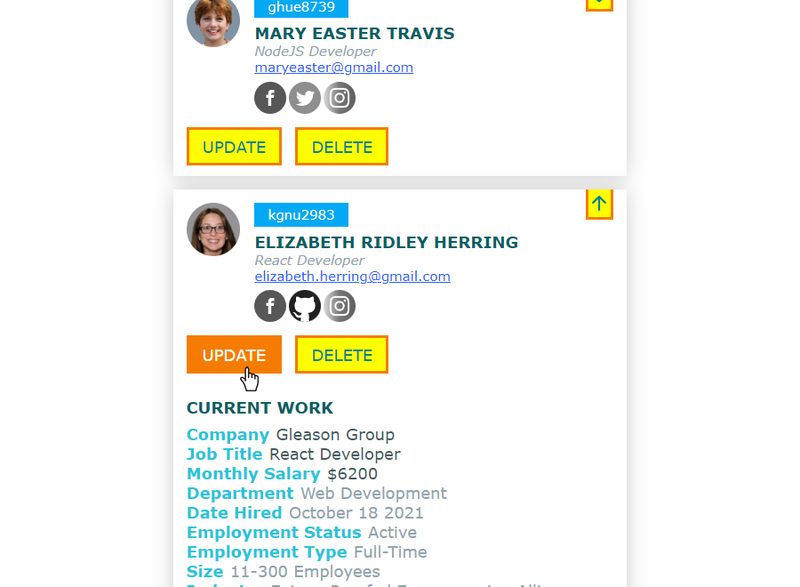

# Person Details Listing

This is a small project I started in July 2022 and finished within the same month. I practiced handling JavaScript ARRAYS and OBJECTS. Assuming I have some person details which I used to create some dummy data that I arranged as Objects within the 'data' variable within the 'data.js' file. This data consist of a person's name, job position, email, current work, employment record and other things. This mini project uses that data to be loaded at the front-end.

The 'DOWN ARROW' when clicked, will show some hidden content of the person displayed at the front-end.

The 'UDPATE' button will show input fields where we can for example change the text, like editing our profile details in Facebook but this mini project doesn't have further functionalities like saving it.

I haven't reached the topic of HIGHER ORDER FUNCTIONS that's why if you check the code, it's mainly constructed by FOR LOOP.

### Screenshot
 

Live Site URL: [Live Demo](https://kennyestrella-person-details-listing.netlify.app/)

### Used tools & technologies
    